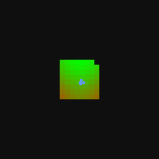

# Multi-Agent Coverage Environment

A high-performance batched multi-agent environment built with C++ (pybind11) and OpenMP for fast parallel simulation of agents exploring a 32×32 grid world with configurable danger maps. Supports two communication modes: **partial-observability** (radio) and **global-communication**.

## Demo



## Features

- **High-Performance**: ~290k FPS (partial-obs) / ~325k FPS (global-comms) for 16 parallel environments
- **Dual Communication Modes**: Partial-observability with radio or full global communication
- **Batched Simulation**: Run multiple independent environments efficiently in parallel via OpenMP
- **Zero-Copy Memory**: Direct memory sharing between C++ backend and PyTorch tensors
- **Gymnasium Compatible**: Standard `gym.vector.VectorEnv` interface
- **Custom Maps**: Load PNG/JPG/BMP or raw binary danger maps; auto-conversion built in
- **Gravity-Based Attractions**: Query attraction vectors towards 17 different map features for each agent
- **PyGame Visualization**: Real-time rendering of environment state with fog-of-war

## Installation

### From Source

```bash
# Clone repository
git clone <repository>
cd craptop

# Create virtual environment
python -m venv .venv
source .venv/bin/activate  # On Windows: .venv\Scripts\activate

# Install in development mode
pip install -e .
```

### Requirements

- Python 3.10+
- pybind11 ≥ 2.6
- Pillow (for PNG map conversion)
- MSVC (Windows) or GCC/Clang (Linux) with OpenMP support

## Project Structure

```
src/
  gravity.h              # Shared header: constants, enums, gravity helpers
  batched_env.cpp        # Partial-obs mode  → _core module
  batched_env_global.cpp # Global-comms mode → _core_global module
multi_agent_coverage/
  __init__.py            # Re-exports BatchedEnvironment + BatchedEnvironmentGlobal
  env_wrapper.py         # Gymnasium wrapper (BatchedGridEnv)
setup.py                 # Builds both C++ extensions
```

## Communication Modes

| | Partial-Obs (Radio) | Global-Comms |
|---|---|---|
| **Backend module** | `_core` | `_core_global` |
| **State stride** | 19,496 floats | 8,200 floats |
| **Observed danger** | Per-agent (4 × 1024) | Shared (1 × 1024) |
| **Observation mask** | Per-agent (4 × 1024) | Shared (1 × 1024) |
| **Expected obs** | Per-agent belief state | N/A (matches obs) |
| **Last agent locations** | Per-agent belief about others | N/A (true positions known) |
| **`communication_prob`** | Controls radio position updates | Ignored |
| **Use case** | Decentralized / partial info | Centralized / full info |

## Maps

The environment supports two map inputs per environment:

| Argument | Purpose |
|---|---|
| `maps` | Ground-truth danger map — what the environment actually uses for movement penalties and rewards |
| `expected_maps` | Prior belief map (e.g. satellite imagery) — used as the agents' initial expected danger before any exploration |

### Map Format

Maps are stored as **raw binary float32 files** (`.bin`) containing 1024 values (32×32 grid, row-major) in the range **`[-1.0, 1.0]`**:

- `-1.0` → completely safe
- ` 0.0` → neutral
- `+1.0` → maximum danger

### PNG / Image Maps

Any PNG, JPG, or BMP image can be passed directly — the wrapper auto-converts it:

1. Converts to grayscale
2. Resizes to 32×32 with Lanczos resampling
3. Normalizes pixel values from `[0, 255]` → `[-1.0, 1.0]`
4. Saves a `.bin` sidecar file next to the image

Light pixels (`255`) map to `+1.0` (danger); dark pixels (`0`) map to `-1.0` (safe).

### Converting Maps Manually

```python
from multi_agent_coverage.env_wrapper import convert_map

# Convert a PNG to a .bin file (saved alongside the image)
bin_path = convert_map("my_map.png")            # -> "my_map.bin"
bin_path = convert_map("my_map.png", "out.bin") # explicit output path
```

Or use the standalone script:

```bash
python map_converter.py
```

### Creating Maps Programmatically

```python
import numpy as np

# 32x32 map: danger concentrated in a circle in the center
y, x = np.mgrid[0:32, 0:32]
dist = np.sqrt((y - 16)**2 + (x - 16)**2)
danger = np.clip(1.0 - dist / 16.0, -1.0, 1.0).astype(np.float32)
danger.flatten().tofile("circle_danger.bin")
```

## API Reference

### `BatchedGridEnv`

High-level gymnasium-compatible wrapper around the C++ environment.

#### Constructor

```python
from multi_agent_coverage.env_wrapper import BatchedGridEnv, FeatureType

env = BatchedGridEnv(
    num_envs=16,              # Number of parallel environments
    n_agents=4,               # Agents per environment (fixed at 4 in C++ backend)
    map_size=32,              # Grid size (fixed at 32x32)
    device='cpu',             # PyTorch device ('cpu' or 'cuda')
    render_mode=None,         # 'human' for pygame window, None for headless
    seed=42,                  # Random seed for procedural map generation
    communication_prob=-1.0,  # Probability [0,1] of radio updates; -1 disables (partial-obs only)
    maps=None,                # str path or list of str paths to ground-truth maps
    expected_maps=None,       # str path or list of str paths to prior belief maps
    global_comms=False,       # If True, use global-communication backend
)
```

**`global_comms`**: When `True`, switches to the global-communication backend where all agents share a single observation mask and observed danger map, know each other's true positions, and require no `expected_obs` or `last_agent_locations` tracking. The state stride drops from 19,496 to 8,200 floats (~2.4× smaller), improving cache locality and throughput.

**Map arguments** accept:
- `None` — procedural sine/cosine map is generated per environment
- `"map0.png"` — same image used for all `num_envs` environments (auto-converted)
- `"map0.bin"` — same binary file used for all environments
- `["map0.bin", "map1.bin", ...]` — one file per environment (list length must equal `num_envs`)

#### Methods

##### `reset(seed=None, options=None)`
Reset all environments and return observations.

```python
obs, info = env.reset()
# obs: torch.Tensor of shape (num_envs, stride)
#   stride = 19496 (partial-obs) or 8200 (global-comms)
```

##### `step(actions)`
Execute actions and return observations, rewards, and terminal flags.

```python
actions = np.random.uniform(-1, 1, (num_envs, n_agents, 2))  # or torch.Tensor
obs, rewards, terminated, truncated, info = env.step(actions)

# obs:        torch.Tensor (num_envs, stride)
# rewards:    torch.Tensor (num_envs, n_agents)
# terminated: torch.Tensor (num_envs,) bool — True when all cells discovered
# truncated:  torch.Tensor (num_envs,) bool — always False (no time limit)
```

In partial-obs mode, `communication_prob` (set in the constructor) is passed to the C++ `step()` to control probabilistic radio position updates between agents. In global-comms mode it is not used.

Environments that terminate are **automatically reset** at the start of their next step.

##### `get_gravity_attractions(feature_type, agent_mask=None, pow=2, normalize=False, local=False)`
Compute gravity attraction vectors for each agent towards cells of a given feature map.

The gravity force from each cell is: $\vec{F} = \text{mass} \cdot \hat{r} / r^{pow}$, summed over all cells (or only cells within view range when `local=True`).

```python
from multi_agent_coverage.env_wrapper import FeatureType

gravity = env.get_gravity_attractions(
    feature_type=FeatureType.GLOBAL_UNDISCOVERED,
    agent_mask=None,   # None = all agents; or np.array([True, True, False, False])
    pow=2,             # Distance power exponent (1 = linear falloff, 2 = quadratic)
    normalize=False,   # If True, scale output so max vector norm = 1.0
    local=False,       # If True, only consider tiles/agents within VIEW_RANGE (7×7)
)
# Returns torch.Tensor of shape (num_envs, n_agents, 2) with (dy, dx) per agent
```

**`local` mode**: When `local=True`, gravity is computed only over the 7×7 tiles the agent can currently see (or nearby agents within view range). This avoids the global attractor/repulsor problem where agents get pulled to map edges or stuck in the center. Particularly useful for `RECENCY_STALE` anti-pheromone navigation.

**Feature Types:**

| Feature Type | Description | Notes |
|---|---|---|
| `EXPECTED_DANGER` | Prior belief danger map (shared) | |
| `ACTUAL_DANGER` | True ground-truth danger map (shared) | |
| `OBSERVED_DANGER` | Observed danger (updated as cells are visited) | Per-agent in partial-obs; shared in global |
| `OBS` | Binary observation mask (1 = cell has been seen) | Per-agent in partial-obs; shared in global |
| `EXPECTED_OBS` | Agent's belief about what all agents have observed | Partial-obs only; aliases to `OBS` in global |
| `GLOBAL_DISCOVERED` | Global binary discovery map (union of all agents' obs) | Same as `OBS` in global mode |
| `GLOBAL_UNDISCOVERED` | Inverse of global discovery (attracts toward unseen cells) | |
| `OBS_UNDISCOVERED` | Per-agent undiscovered cells | Aliases to `GLOBAL_UNDISCOVERED` in global |
| `EXPECTED_OBS_UNDISCOVERED` | Per-agent expected undiscovered cells | Aliases to `GLOBAL_UNDISCOVERED` in global |
| `OTHER_AGENTS` | Gravity from current positions of other agents | |
| `OTHER_AGENTS_LAST_KNOWN` | Gravity from last known positions of other agents | Same as `OTHER_AGENTS` in global mode |
| `RECENCY` | Per-agent recency map — tiles in view set to 1.0 each frame, decay by ×0.99 | |
| `RECENCY_STALE` | Inverse of recency (1.0 − recency). Anti-pheromone effect | |
| `WALL_REPEL` | Repelling force from map border walls | |
| `WALL_ATTRACT` | Attracting force toward map border walls | |
| `GLOBAL_VORONOI_UNDISCOVERED` | Voronoi-partitioned undiscovered tiles using oracle data (`global_discovered` + true agent positions) | Oracle info — suitable for reward shaping or centralized use; **not epistemically correct** for agent decisions in partial-obs |
| `EXPECTED_VORONOI_UNDISCOVERED` | Voronoi-partitioned undiscovered tiles using agent *i*'s own belief (`expected_obs[i]` + `last_agent_locations[i]`) | Epistemically correct for decentralized decision-making in partial-obs; identical to `GLOBAL_VORONOI_UNDISCOVERED` in global-comms mode |

**Voronoi / Territorial Gravity:**

The two `VORONOI_UNDISCOVERED` variants assign each undiscovered tile to the **nearest agent** (Manhattan distance). Each agent only attracts toward the tiles in its own Voronoi territory, which prevents all agents from swarming toward the same final unexplored patch.

| Variant | Discovery map | Agent positions used | Use case |
|---|---|---|---|
| `GLOBAL_VORONOI_UNDISCOVERED` | `global_discovered` (union of all agents' true obs) | True `agent_locations` | Reward shaping, centralized critics, global-comms mode |
| `EXPECTED_VORONOI_UNDISCOVERED` | `expected_obs[i]` (agent *i*'s belief) | `last_agent_locations[i]` (last radio-reported positions) | Decentralized policy input in partial-obs |

In **global-comms mode** both variants are identical (they both use the shared `obs` map and true positions). The distinction only matters in **partial-obs** mode, where `GLOBAL_VORONOI_UNDISCOVERED` leaks oracle information and should only be used outside the agent's policy network (e.g., to compute a shaped reward in the training loop).

```python
# Partial-obs: give each agent its own territorial gravity (epistemically correct)
gravity = env.get_gravity_attractions(FeatureType.EXPECTED_VORONOI_UNDISCOVERED, pow=1)

# Use GLOBAL variant only for reward shaping (not as policy input)
global_gravity = env.get_gravity_attractions(FeatureType.GLOBAL_VORONOI_UNDISCOVERED, pow=1)
```

**Agent Mask:**
```python
# Compute gravity only for the first two agents; others get zero vectors
mask = np.array([True, True, False, False])
gravity = env.get_gravity_attractions(FeatureType.GLOBAL_UNDISCOVERED, agent_mask=mask)
```

##### `render()`
Render the first environment to a pygame window. Called automatically each step when `render_mode='human'`.

The window shows:
- **Black cells**: undiscovered (fog of war)
- **Green cells**: discovered, safe (`danger ≈ -1.0`)
- **Yellow cells**: discovered, neutral danger (`danger ≈ 0.0`)
- **Red cells**: discovered, high danger (`danger ≈ +1.0`)
- **Blue circles**: agent positions with translucent 7×7 view-range boxes

```python
env = BatchedGridEnv(num_envs=4, render_mode='human')
obs, _ = env.reset()

try:
    while True:
        actions = np.random.uniform(-1, 1, (4, 4, 2))
        env.step(actions)  # render() called automatically
except KeyboardInterrupt:
    env.close()
```

##### `close()`
Close the pygame window and release resources.

## Usage Examples

### Basic Loop

```python
import numpy as np
from multi_agent_coverage.env_wrapper import BatchedGridEnv

env = BatchedGridEnv(num_envs=8, n_agents=4)
obs, _ = env.reset()

for step in range(1000):
    actions = np.random.uniform(-1, 1, (8, 4, 2))
    obs, rewards, terminated, truncated, info = env.step(actions)

env.close()
```

### Global-Comms Mode

```python
from multi_agent_coverage.env_wrapper import BatchedGridEnv

# Global communication — 2.4× smaller state, ~12% faster stepping
env = BatchedGridEnv(num_envs=16, global_comms=True)
obs, _ = env.reset()
print(f"Stride: {obs.shape[1]}")  # 8200 instead of 19496

for _ in range(1000):
    actions = np.random.uniform(-1, 1, (16, 4, 2))
    obs, rewards, terminated, truncated, info = env.step(actions)

env.close()
```

### Partial-Obs with Radio Communication

```python
from multi_agent_coverage.env_wrapper import BatchedGridEnv

# Agents update each other's positions with 30% probability per step
env = BatchedGridEnv(num_envs=16, communication_prob=0.3, global_comms=False)
obs, _ = env.reset()

for _ in range(1000):
    actions = np.random.uniform(-1, 1, (16, 4, 2))
    obs, rewards, terminated, truncated, info = env.step(actions)

env.close()
```

### With Custom Maps

```python
from multi_agent_coverage.env_wrapper import BatchedGridEnv

# Same map for all envs (PNG auto-converted to .bin on first run)
env = BatchedGridEnv(
    num_envs=8,
    maps="map0.png",
    expected_maps="expected_map0.png",
)

# Different maps per env
env = BatchedGridEnv(
    num_envs=2,
    maps=["map0.bin", "map1.bin"],
    expected_maps=["expected_map0.bin", "expected_map1.bin"],
)
```

### Gravity-Based Navigation

```python
from multi_agent_coverage.env_wrapper import BatchedGridEnv, FeatureType
import numpy as np

env = BatchedGridEnv(num_envs=16, maps="map0.png", expected_maps="expected_map0.png")
obs, _ = env.reset()

for step in range(1000):
    # Pull toward undiscovered areas, away from danger and other agents
    toward_unknown = env.get_gravity_attractions(FeatureType.GLOBAL_UNDISCOVERED, normalize=True, pow=1)
    avoid_danger   = env.get_gravity_attractions(FeatureType.OBSERVED_DANGER,     normalize=True, pow=2)
    spread_out     = env.get_gravity_attractions(FeatureType.OTHER_AGENTS,        normalize=True, pow=1)

    # Anti-pheromone: push agents away from areas they've recently visited
    leave_area     = env.get_gravity_attractions(FeatureType.RECENCY_STALE, normalize=True, pow=1, local=True)

    actions = toward_unknown - avoid_danger - spread_out + 0.3 * leave_area
    obs, rewards, terminated, truncated, info = env.step(actions)

env.close()
```

## Observation Space Layout

### Partial-Obs Mode (stride = 19,496)

```
Offset  | Size  | Content                  | Shape         | Range
--------|-------|--------------------------|---------------|----------
0       | 1024  | Expected Danger          | (32, 32)      | [-1, 1]
1024    | 1024  | Actual Danger            | (32, 32)      | [-1, 1]
2048    | 4096  | Observed Danger (×4)     | (4, 32, 32)   | [-1, 1]
6144    | 4096  | Observation Mask (×4)    | (4, 32, 32)   | {0, 1}
10240   | 8     | Agent Locations          | (4, 2)        | [0, 31] [y, x]
10248   | 4096  | Expected Obs (×4)        | (4, 32, 32)   | {0, 1}
14344   | 32    | Last Agent Locations     | (4, 4, 2)     | [0, 31]
14376   | 1024  | Global Discovered        | (32, 32)      | {0, 1}
15400   | 4096  | Recency (×4)             | (4, 32, 32)   | [0, 1]
```

- **Observed Danger**: Each agent's own observed danger map. Initialized from `expected_danger`, updated with `actual_danger` as tiles enter view.
- **Expected Obs**: Agent *i*'s belief about what *all* agents have observed, based on `last_agent_locations[i]`. Cumulative (never cleared).
- **Last Agent Locations**: Agent *i*'s last known position of agent *j*, updated when *j* is within view range or via radio communication.

### Global-Comms Mode (stride = 8,200)

```
Offset  | Size  | Content                  | Shape         | Range
--------|-------|--------------------------|---------------|----------
0       | 1024  | Expected Danger          | (32, 32)      | [-1, 1]
1024    | 1024  | Actual Danger            | (32, 32)      | [-1, 1]
2048    | 1024  | Observed Danger (shared) | (32, 32)      | [-1, 1]
3072    | 1024  | Obs / Global Discovered  | (32, 32)      | {0, 1}
4096    | 8     | Agent Locations          | (4, 2)        | [0, 31] [y, x]
4104    | 4096  | Recency (×4)             | (4, 32, 32)   | [0, 1]
```

- All agents share a single observed danger map and observation mask.
- `obs` serves as the global discovered map (single source of truth).
- No `expected_obs` or `last_agent_locations` — agents know everything.

## Recording Demonstrations

Generate an animated GIF matching the pygame renderer:

```bash
python gif.py
```

## Performance

Benchmark results (16 parallel environments, 10k frames, Windows / MSVC with OpenMP):

| Mode | Stride | Step FPS | Gravity Calls/s |
|------|--------|----------|-----------------|
| Partial-obs | 19,496 | ~290,000 | ~18,000 |
| Global-comms | 8,200 | ~325,000 | ~18,000 |

Global-comms mode is ~12% faster at stepping due to the smaller state stride and fewer per-step computations. Gravity performance is similar since it's dominated by the tile iteration, not state size.

## Environment Details

### State
- **Map Size**: 32×32 fixed grid
- **Agents per Env**: 4 fixed
- **Agent Speed**: 0.5 cells/step (reduced in danger zones)
- **View Range**: 3 cells (7×7 view window)
- **Danger Scale**: `[-1.0, 1.0]` — negative is safe, positive is dangerous
- **Recency Decay**: ×0.99 per frame

### Rewards
Agents receive `+1.0` reward (split equally among agents that can see the tile) for each newly discovered cell. A `+10.0` bonus is awarded to all agents when all 1024 cells are discovered, ending the episode.

### Dynamics
- Action vectors are L2-normalized before being applied
- Effective speed per step: `SPEED × (1 - 0.8 × danger)` at the agent's current cell
- Agent positions are clamped to `[0, 31.99]` on both axes
- Terminated environments auto-reset at the start of their next `step()` call

## Building from Source

The package builds two C++ extensions:

| Extension | Source | Purpose |
|-----------|--------|---------|
| `_core` | `src/batched_env.cpp` | Partial-obs mode |
| `_core_global` | `src/batched_env_global.cpp` | Global-comms mode |

Both include the shared header `src/gravity.h` containing constants, the `FeatureType` enum, and all gravity computation functions.

```bash
# Install build dependencies
pip install pybind11 setuptools build pillow

# Install in editable mode (compiles both extensions)
pip install -e .
```

## License

MIT
